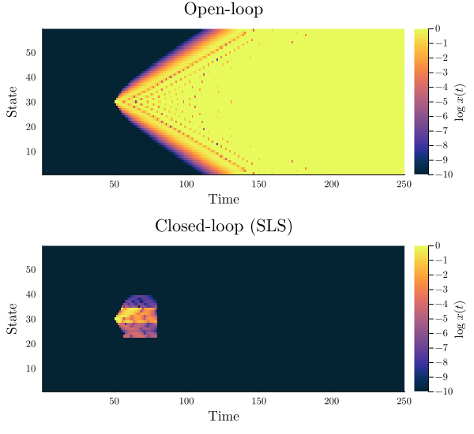

<p align="center"></p>
<p align="center">
<a href="https://aaltoKEPO.github.io/SystemLevelControl.jl/stable/"></a>
<a href="https://aaltoKEPO.github.io/SystemLevelControl.jl/dev/"></a>
<a href="https://github.com/aaltoKEPO/SystemLevelControl.jl/actions/workflows/CI.yml?query=branch%3Amain"></a>
<a href="https://codecov.io/gh/aaltoKEPO/SystemLevelControl.jl"></a></p>
</p>

---

**SystemLevelControl** is a [Julia](https://julialang.org/) toolbox for synthesizing controllers using the [System Level Synthesis](https://arxiv.org/abs/1904.01634) (SLS) methodology. We aim at providing a straightforward, [`@Distributed`](https://docs.julialang.org/en/v1/manual/distributed-computing/)-enabled, interface for optimal and robust control of large-scale cyberphysical systems.

## Installation

This package is currently not in the official registry.

In order to use **SystemLevelControl.jl**, you can add this repository directly:

```julia
using Pkg; Pkg.add("https://github.com/aaltoKEPO/SystemLevelControl.jl")
```

or entering `]add https://github.com/aaltoKEPO/SystemLevelControl.jl` in the Julia REPL. 

## Usage


The following example illustrates how a spatiotemporal-localized controller can be synthesized using this toolbox. Consider the $\mathcal{H}_2$ state-feedback SLS problem

$$\begin{aligned}
    \min_{\Phi_x, \Phi_u} &\quad \left\| C_1\Phi_x + D_{12} \Phi_u  \right\|_{\mathcal{H}_2} \\
    \text{s.t.} 
        & \quad z\Phi_x = A\Phi_x + B_2\Phi_u \\
        & \quad \Phi_x, \Phi_u \in \mathcal{L}_d\cap\mathcal{F}_T\cap\mathcal{D}
\end{aligned}$$

where $A \in \mathbb{R}^{59\times 59}$ is a tri-diagonal matrix, and $B_2 \in \mathbb{R}^{59\times 20}$ has the $(6n{+}1,~2n{+}1)$-th and $(6n{+}2,~2n{+}2)$-th entries equal to 1 (and zero elsewhere). Furthermore, let $[C_1\ D_{12}] = I$. The controller is $(d,T)$-localized assuming a localization constraint with $d = 9$, finite-impulse response (FIR) constraint with $T = 29$, and communication delay $t_c = 1.5$. (see [(Anderson et. al., 2019)](https://arxiv.org/abs/1904.01634) for details). This problem can be modelled and solved by the following script:

```julia
using SystemLevelControl, LinearAlgebra, SparseArrays

# Definition of the (generalized) state-space model
Nx, Nu = (59, 20);
    
A = I + spdiagm(1 => 0.2ones(Nx-1)) - spdiagm(-1 => 0.2ones(Nx-1));
B₁ = I(Nx);
B₂ = spdiagm(0 => ones(Nx))[:,vec((1:2).+6(0:9)')];

P = Plant(A, B₁, B₂);

# Definition of (d,T)-localization constraints
d,T,α = (9, 29, 1.5);
𝓢ₓ = [           (A .≠ 0)^min(d,  floor(α*(t-1))) .≠ 0 for t = 1:T];
𝓢ᵤ = [(B₂' .≠ 0)*(A .≠ 0)^min(d+1,floor(α*(t-1))) .≠ 0 for t = 1:T];

# Solves the 𝓗₂ state-feedback problem
Φₓ,Φᵤ = SLS_𝓗₂(P, [𝓢ₓ,𝓢ᵤ]);
```

Finally, the closed-loop response, with a unit impulse disturbance $w(t) = \delta(t{-}50)e_{30}$, can then be simulated as:
```julia
w(t) = (t==50)*I(59)[:,30]
x = spzeros(Nx,250); 
β = similar(x); u = spzeros(Nu,250)

for t = 1:250-1
    β[:,t+1] = sum([Φₓ[τ+1]*(x[:,t+1-τ] - β[:,t+1-τ]) for τ = 1:min(t,T-1)]);
    u[:,t]   = sum([Φᵤ[ τ ]*(x[:,t+1-τ] - β[:,t+1-τ]) for τ = 1:min(t,T)  ]);
    
    x[:,t+1] = A*x[:,t] + B₁*w(t) + B₂*u[:,t];
end
```

<p align="center">

</p>

The above script also automatically solves the SLS problem using distributed computation if Julia was started with the desired number of workers (e.g., with `julia -p 8`, or by using the `addprocs` command). This can dramatically speed up computation and effectively distribute the synthesis problem across multiple CPUs (however, with an increase in memory usage if distributed locally). 

## Notes

**This package is under development and is intended to provide a framework for efficiently solving System Level Synthesis problems.** Although general-purpose, the SLS methodology is focused on large-scale cyber-physical systems with sparse communication and actuation networks. As such, our toolbox is designed for linear discrete-time systems, restricted to `SparseArrays` data-types, and we focus on the linear fractional transformation (LFT) framework (see [Zhou's & Doyle's](https://www.ece.lsu.edu/kemin/essentials.htm) textbook). We hope to improve **SystemLevelControl.jl** (and the research on SLS methods) so that in the future it can serve as a general-purpose control framework.

For doing analysis or solving more general control problems, we recommend other excellent Julia packages:

- [`ControlSystems.jl`](https://juliacontrol.github.io/ControlSystems.jl/stable/) and its associated Ecosystem provide a wide collection of tools for analysis and design of control systems. It provides a similar interface as that of the popular Control Systems Toolbox in MATLAB®.
- [`JuMP.jl`](https://jump.dev/JuMP.jl/stable/) is perhaps the most popular modelling framework for mathematical optimization in Julia. A wide class of optimal control problems (including LMIs/SDPs) can be solved with this package. **SystemLevelControl.jl** actually use JuMP to solve SLS problems for the general cases.
- [`TrajectoryOptimization.jl`](http://roboticexplorationlab.org/TrajectoryOptimization.jl/stable/) is a popular framework for solving trajectory optimization problems in Julia, specially for applications in robotics. A distinct feature is the possibility to easily model nonlinear control problems.
- [`JuliaSimControl.jl`](https://help.juliahub.com/juliasimcontrol/stable/) is the package within the JuliaSim Ecosystem that allows for the modelling, analysis and deployment of control systems in a centralized package.


